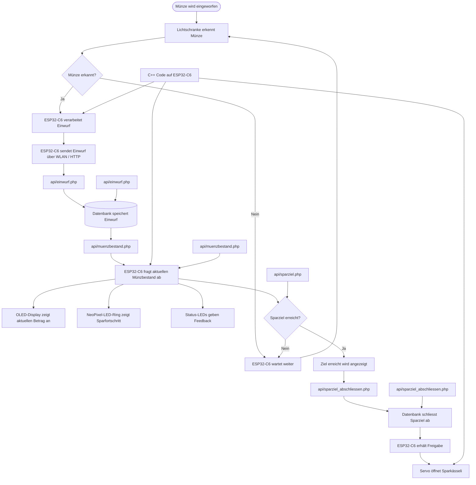

## Kurzbeschreibung des Projekts

* **Modul:** Interaktive Medien 4 an der Fachhochschule Graubünden (FS26)  
* **Themenfeld:** IoT-Applikation zum Thema Eltern mit kleinen Kindern  
* **Name des Projekts:** \*Kässeli*\   
* **Team Physical Computing:** \*Rabia Pakmak & Andrin Zünd*\  
* **Team WebApp:** \*Marko Milovanovic & Ville Lindskog*\
 
 
* Welches Problem im Alltag von Eltern mit kleinen Kindern wird gelöst?
* In einer zunehmend bargeldlosen Gesellschaft wird es für Eltern schwieriger, Kindern den Wert von Geld beizubringen. Unser Smarte Sparschwein löst dieses Problem: Es bewahrt das wichtige haptische Erlebnis des physischen Münzeinwurfs, verknüpft es aber mit einer zeitgemässen, digitalen Übersicht.
Bei klassischen Sparschweinen verliert man schnell den Überblick. Eltern und Kinder müssen das Schwein nicht mehr mühsam ausschütten und Geld zählen, um zu wissen, ob es für den nächsten Wunsch reicht.
Kinder verlieren oft die Motivation am Sparen, wenn der Fortschritt unsichtbar im Bauch des Sparschweins verborgen bleibt. Unser System macht den Erfolg in Echtzeit sichtbar.

* Was ist der «Sinn und Zweck» des Systems?
* Der Hauptzweck des Smarten Sparschweins liegt in der spielerischen und hybriden (Hardware + Web-App) finanziellen Früherziehung (Financial Literacy) für Kinder.
Über die Web-App können Kinder konkrete Sparziele definieren (z. B. ein neues Fahrrad oder ein Lego-Set). Das System berechnet automatisch den Fortschritt bis zum Zielbetrag und zeigt visuell an, wann das Ziel erreicht ist (sparziel-Tabelle).
Durch die lückenlose Aufzeichnung (einwurf_historie) und die exakte Kategorisierung der Münzarten (muenzbestand) entstehen spannende Statistiken. Kinder lernen, wie sich ihr Erspartes zusammensetzt und dass auch kleine Münzen über die Zeit zu einem grossen Betrag anwachsen.

Durch die Verknüpfung von Benutzerprofilen (users) mit spezifischen Geräten (sparschwein) bekommt jedes Kind seinen eigenen, geschützten Bereich. Es lernt, Verantwortung für die eigenen Finanzen zu übernehmen, während die Eltern unterstützend auf die Auswertungen zugreifen können.

\[*Bilder / GIFs (optional)*\]

### UX & Konzeption

*In diesem Teil werden die gemeinsamen Schritte aus der UX-Abgabe dokumentiert, damit sich hier alles vollständig an einem Ort befindet (betrifft WebApp und Physical Computing)*

* **Figma:** [Link zum Figma]([http://link.zum.figma](https://www.figma.com/make/G5A9d7Aujy5s7Okq11wbhd/K%C3%A4ssli-von-Max-Webapp?t=7J1PzznwdcErMny0-1))
* **User Flow \+ Screen Flow** (Screenshot aus Figma)  
* ggf. weitere Ergänzungen
* *Welche Features waren angedacht?*
Wir hatten anfangs die Idee, dass das Sparschwein alle Münzen zählen kann (auch 5 Räppler).
* *Welche Features wurden nicht umgesetzt? (Warum)*
Das Sparschwein wäre viel zu gross geworden und hätte zu viele Sensoren gebraucht.
### Setup

* **WebApp:** [Link zur Website]( https://im4-varm.villelindskog.ch/login.html)  
* **Video-Dokumentation:** [Link zum Video auf Youtube](http://link.zum.video) 

#### Installationsanleitung WebApp

***verständliche** Schritt-für-Schritt-Anleitung für Aussenstehende, um das Projekt zu klonen und auf einem eigenen Server zu installieren*

1. *Was benötige ich an Infrastruktur?*
**Webserver / Hosting:** Ein aktives Webhosting-Paket (z. B. bei Infomaniak, Cyon, Hostpoint) mit einer öffentlich erreichbaren Domain oder Subdomain. * **Datenbank:** Eine freie MySQL- oder MariaDB-Datenbank auf deinem Hosting-Server. * **FTP/SFTP-Zugang:** Zugangsdaten deines Hosters sowie ein Client (wie *Cyberduck*, *FileZilla* oder die *SFTP-Erweiterung für VS Code*), um die Dateien hochzuladen. * **Git:** Auf deinem lokalen Rechner installiert, falls du das Repository direkt klonen möchtest.
2. *Was muss ich auf meinem Webserver installieren?*
Es ist keine manuelle Installation von Software-Paketen auf dem Server notwendig, da das Backend auf einem schlanken PHP-Skript-Setup basiert. Stelle lediglich im Control Panel deines Hosters folgende Konfiguration sicher:
* **PHP-Version:** Mindestens **PHP 7.4** oder neuer (Empfohlen: **PHP 8.x**).
* **PDO-Erweiterung:** Das PHP-Modul `pdo_mysql` muss aktiviert sein, um sichere Datenbankverbindungen zu gewährleisten.  
3. *Wie kann ich die Datenbank importieren?*
Wähle deine DB, klicke auf **SQL** und führe diesen kompakten Block aus:

```sql
CREATE TABLE users (id INT AUTO_INCREMENT PRIMARY KEY, first_name VARCHAR(100), email VARCHAR(100) UNIQUE NOT NULL, password VARCHAR(255) NOT NULL) ENGINE=InnoDB;
CREATE TABLE sparschwein (id INT AUTO_INCREMENT PRIMARY KEY, user_id INT NOT NULL, name VARCHAR(100) NOT NULL, geraete_id VARCHAR(100) UNIQUE NOT NULL, erstellt_am TIMESTAMP DEFAULT CURRENT_TIMESTAMP, FOREIGN KEY (user_id) REFERENCES users(id) ON DELETE CASCADE) ENGINE=InnoDB;
CREATE TABLE einwurf_historie (id INT AUTO_INCREMENT PRIMARY KEY, sparschwein_id INT NOT NULL, muenz_wert DECIMAL(5,2) NOT NULL, eingeworfen_am TIMESTAMP DEFAULT CURRENT_TIMESTAMP, FOREIGN KEY (sparschwein_id) REFERENCES sparschwein(id) ON DELETE CASCADE) ENGINE=InnoDB;
CREATE TABLE muenzbestand (id INT AUTO_INCREMENT PRIMARY KEY, sparschwein_id INT NOT NULL, muenz_wert DECIMAL(5,2) NOT NULL, anzahl INT NOT NULL DEFAULT 0, FOREIGN KEY (sparschwein_id) REFERENCES sparschwein(id) ON DELETE CASCADE) ENGINE=InnoDB;
CREATE TABLE sparziel (id INT AUTO_INCREMENT PRIMARY KEY, sparschwein_id INT NOT NULL, titel VARCHAR(255) NOT NULL, ziel_betrag DECIMAL(10,2) NOT NULL, ist_erreicht TINYINT(1) NOT NULL DEFAULT 0, erstellt_am TIMESTAMP DEFAULT CURRENT_TIMESTAMP, FOREIGN KEY (sparschwein_id) REFERENCES sparschwein(id) ON DELETE CASCADE) ENGINE=InnoDB;
```
4. *Wo muss ich die DB-Credentials eintragen?*
Benenne die Datei `system/config.php.blank` in `config.php` um und füge deine DB-Daten ein:
```php
<?php
$host = 'localhost'; $db = 'db_name'; $user = 'db_user'; $pass = 'db_pass';
try { $pdo = new PDO("mysql:host=$host;dbname=$db;charset=utf8mb4", $user, $pass, [PDO::ATTR_ERRMODE => PDO::ERRMODE_EXCEPTION]); }
catch (Exception $e) { die("DB-Fehler: " . $e->getMessage()); }
```
5. *Wie lade ich die App-Dateien hoch?* Lade alle verbleibenden Dateien und Ordner (api/, system/, js/, css/ sowie die .html-Dateien) per SFTP-Client direkt in das Stammverzeichnis (public_html oder www) deines Webservers hoch. Die erstellte config.php bleibt durch die .gitignore lokal geschützt. 
7. *Wie nehme ich das physische Artefakt in Betrieb?*
ardware-Code: Trage im Skript deines Mikrocontrollers deine WLAN-Daten, eine eindeutige geraete_id (z. B. "SCHWEIN_01") und die URL zu deinem API-Münzeinwurf-Endpunkt (z. B. https://deinedomain.ch/api/einwurf.php) ein.

- Registrierung: Erstelle ein Konto über register.html, logge dich ein und füge dein Sparschwein mit exakt derselben geraete_id in deiner WebApp hinzu.

- Funktionstest: Schalte das physische Sparschwein ein. Ein Münzeinwurf sendet den Wert via HTTP-POST (JSON) an das Backend und aktualisiert das Dashboard live!

#### Bauanleitung Physical Computing

* ***Was muss ich wie bauen, verbinden, installieren?***  
* *ergänze: **Komponentenplan** (betrifft Physical Computing, vgl. Slides Kapitel 15): Schaubild enthält*  
  * *die eingesetzten Komponenten*  
  * *die verbundenen Sensoren und Aktoren*  
  * *die Programme (mit Dateinamen)*  
  * *die Kommunikationswege* 

* *ergänze: **Steckplan** (betrifft Physical Computing, vgl. Slides Kapitel 15): generiert z.B. mit Fritzing (empfohlen), Tinkercad, Wokwi*  
  * *beachtet die [Fritzing Parts](https://github.com/Interaktive-Medien/im_physical_computing/tree/main/15_Intro_Projektdoku) extra für euch*  
* *ggf. **Bildmaterial***

## technische Details

// Hier sollte das Verständnis ersichtlich sein / Wie stehen die Dateien in Beziehung zueinander, Wie reden Die Dateien miteinander, Wie ist der Weg der Daten

* **Projektstruktur / Code-Struktur:** \[*Hinweis: Der Code selbst muss im Repository liegen und im Kopfbereich jeder Datei eine kurze Zusammenfassung enthalten.*\]  
* **Datenschnittstelle: \[***zwischen WebApp und Physical Computing*\]  
* **ERM:** \[*Erklärung und Schaubild*\]  
* **Authentifizierung:** \[*Erklärung*\]

## Known bugs

* Was funktioniert noch nicht einwandfrei?  
* Was ist uns aufgefallen bei der Entwicklung?  
* Was könnte noch verbessert werden?

## Umsetzungsprozess

* **Reflexion / Erfahrung / Lernfortschritt:** *
*Was haben wir gelernt?*
Wir haben gelernt, wie man die Brücke zwischen Physical Computing (Hardware) und einem Full-Stack-Web-System schlägt. Besonders intensiv haben wir uns mit dem Entwurf relationaler Datenbanken auseinandergesetzt, um nicht nur Gesamtbeträge, sondern auch Münzbestände und Einwurf-Historien sauber abzubilden. Zudem haben wir verstanden, wie wichtig eine saubere API-Trennung mittels JSON ist – die Hardware kommuniziert genauso per HTTP-POST mit der API wie unser JavaScript-Frontend.

*Würden wir es nochmal genauso machen?*
Ja, die grundlegende Architektur (PHP-PDO-Backend + Vanilla JS Frontend) war für den Lerneffekt ideal. Bei einem Folgeprojekt würden wir jedoch für die Live-Updates in der WebApp auf WebSockets statt klassisches HTTP-Polling setzen, damit das Dashboard beim Münzeinwurf absolut verzögerungsfrei und ohne Page-Reload reagiert.

*Was war gut / was war schlecht?*
Gut: Die modulare Strukturierung in api/ und system/ hielt den Code übersichtlich und leicht erweiterbar. Das Absichern der Benutzer-Session per HttpOnly-Cookie lief reibungslos.
Schlecht: Das Debuggen der HTTP-Requests, die direkt vom Mikrocontroller abgeschickt wurden, war mühsam, da man kein klassisches Browser-Log (DevTools) zur Verfügung hat. Hier mussten wir anfangs blind auf Server-Fehlercodes reagieren.

* **Herausforderungen & Lösungen:** \[*Verworfene Ansätze, Fehler, Umplanungen*\]
Verworfener Ansatz: Ursprünglich wollten wir alle Münzen 5 Räppler bis 5 Liber zählen. Das sprengte aber den Rahmen unserer Motivation und wäre viel zu gross geworden mit zu vielen Sensoren. Wir haben es nicht umgesetzt.

*KI-Einsatz*
Verwendete Tools: Gemini / ChatGPT
Die KI wurde als Co-Pilot eingsetzt und hat uns bei fast allen Phasen der Entwicklung geholfen. Ihr Nutzen erstreckte sich über nahezu das gesamte Projek

*Fazit*
Das Projekt "Smartes Sparschwein" zeigt eindrucksvoll, wie greifbar und interaktiv moderne Webtechnologien werden, wenn man sie mit physischer Hardware kombiniert. Trotz anfänglicher Hürden beim API-Datenaustausch und der Tabellen-Strukturierung 

