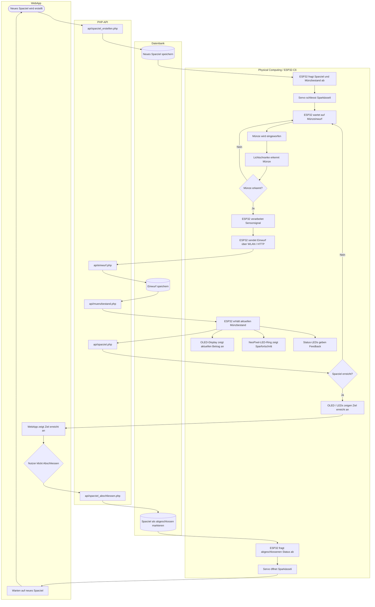
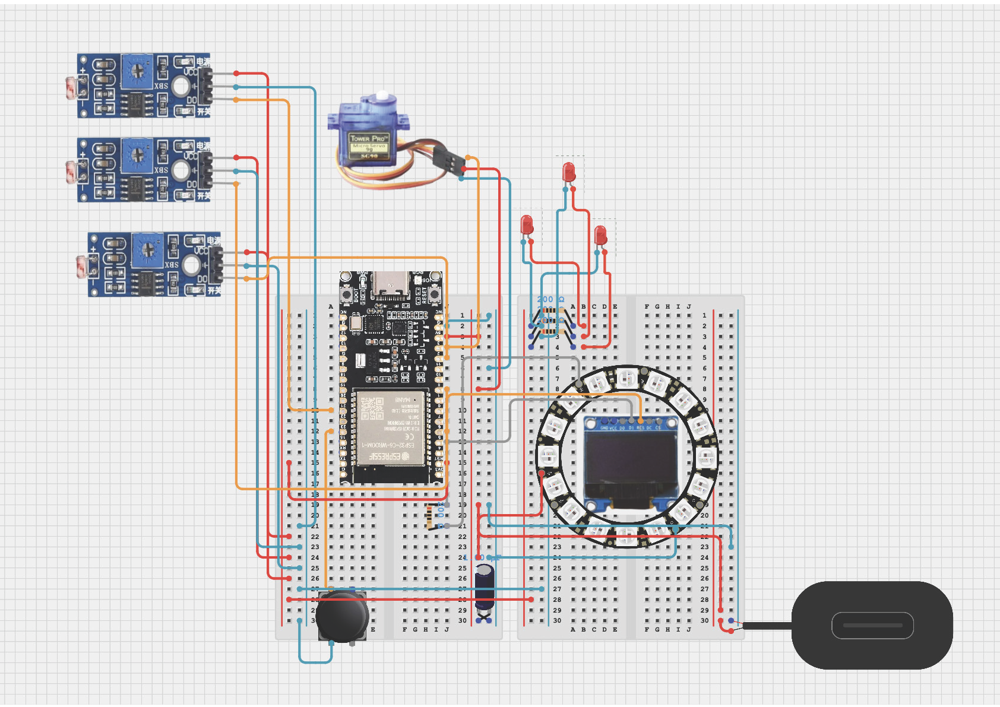

## Kurzbeschreibung des Projekts

* **Modul:** Interaktive Medien 4 an der Fachhochschule Graubünden (FS26)  
* **Themenfeld:** IoT-Applikation zum Thema Eltern mit kleinen Kindern  
* **Name des Projekts:** \*Kässeli*\   
* **Team Physical Computing:** \*Rabia Pakmak & Andrin Zünd*\  
* **Team WebApp:** \*Marko Milovanovic & Ville Lindskog*\
 
 
* Welches Problem im Alltag von Eltern mit kleinen Kindern wird gelöst?
* In einer zunehmend bargeldlosen Gesellschaft wird es für Eltern schwieriger, Kindern den Wert von Geld beizubringen. Unser Smarte Sparschwein löst dieses Problem: Es bewahrt das wichtige haptische Erlebnis des physischen Münzeinwurfs, verknüpft es aber mit einer zeitgemässen, digitalen Übersicht.
Bei klassischen Sparschweinen verliert man schnell den Überblick. Eltern und Kinder müssen das Schwein nicht mehr mühsam ausschütten und Geld zählen, um zu wissen, ob es für den nächsten Wunsch reicht.
Kinder verlieren oft die Motivation am Sparen, wenn der Fortschritt unsichtbar im Bauch des Sparschweins verborgen bleibt. Unser System macht den Erfolg in Echtzeit sichtbar.

* Was ist der «Sinn und Zweck» des Systems?
* Der Hauptzweck des Smarten Sparschweins liegt in der spielerischen und hybriden (Hardware + Web-App) finanziellen Früherziehung (Financial Literacy) für Kinder.
Über die Web-App können Kinder konkrete Sparziele definieren (z. B. ein neues Fahrrad oder ein Lego-Set). Das System berechnet automatisch den Fortschritt bis zum Zielbetrag und zeigt visuell an, wann das Ziel erreicht ist (sparziel-Tabelle).
Durch die lückenlose Aufzeichnung (einwurf_historie) und die exakte Kategorisierung der Münzarten (muenzbestand) entstehen spannende Statistiken. Kinder lernen, wie sich ihr Erspartes zusammensetzt und dass auch kleine Münzen über die Zeit zu einem grossen Betrag anwachsen.

Durch die Verknüpfung von Benutzerprofilen (users) mit spezifischen Geräten (sparschwein) bekommt jedes Kind seinen eigenen, geschützten Bereich. Es lernt, Verantwortung für die eigenen Finanzen zu übernehmen, während die Eltern unterstützend auf die Auswertungen zugreifen können.

\[*Bilder / GIFs (optional)*\]

### UX & Konzeption

*In diesem Teil werden die gemeinsamen Schritte aus der UX-Abgabe dokumentiert, damit sich hier alles vollständig an einem Ort befindet (betrifft WebApp und Physical Computing)*

* **Figma:** [Link zum Figma]([http://link.zum.figma](https://www.figma.com/make/G5A9d7Aujy5s7Okq11wbhd/K%C3%A4ssli-von-Max-Webapp?t=7J1PzznwdcErMny0-1))
* **User Flow \+ Screen Flow** (Screenshot aus Figma)  
* ggf. weitere Ergänzungen
* *Welche Features waren angedacht?*
Wir hatten anfangs die Idee, dass das Sparschwein alle Münzen zählen kann (auch 5 Räppler).
* *Welche Features wurden nicht umgesetzt? (Warum)*
Das Sparschwein wäre viel zu gross geworden und hätte zu viele Sensoren gebraucht.
### Setup

* **WebApp:** [Link zur Website]( https://im4-varm.villelindskog.ch/login.html)  
* **Video-Dokumentation:** [Link zum Video auf Youtube](http://link.zum.video) 

#### Installationsanleitung WebApp

***verständliche** Schritt-für-Schritt-Anleitung für Aussenstehende, um das Projekt zu klonen und auf einem eigenen Server zu installieren*

1. *Was benötige ich an Infrastruktur?*
**Webserver / Hosting:** Ein aktives Webhosting-Paket (z. B. bei Infomaniak, Cyon, Hostpoint) mit einer öffentlich erreichbaren Domain oder Subdomain. * **Datenbank:** Eine freie MySQL- oder MariaDB-Datenbank auf deinem Hosting-Server. * **FTP/SFTP-Zugang:** Zugangsdaten deines Hosters sowie ein Client (wie *Cyberduck*, *FileZilla* oder die *SFTP-Erweiterung für VS Code*), um die Dateien hochzuladen. * **Git:** Auf deinem lokalen Rechner installiert, falls du das Repository direkt klonen möchtest.
2. *Was muss ich auf meinem Webserver installieren?*
Es ist keine manuelle Installation von Software-Paketen auf dem Server notwendig, da das Backend auf einem schlanken PHP-Skript-Setup basiert. Stelle lediglich im Control Panel deines Hosters folgende Konfiguration sicher:
* **PHP-Version:** Mindestens **PHP 7.4** oder neuer (Empfohlen: **PHP 8.x**).
* **PDO-Erweiterung:** Das PHP-Modul `pdo_mysql` muss aktiviert sein, um sichere Datenbankverbindungen zu gewährleisten.  
3. *Wie kann ich die Datenbank importieren?*
Wähle deine DB, klicke auf **SQL** und führe diesen kompakten Block aus:

```sql
CREATE TABLE users (id INT AUTO_INCREMENT PRIMARY KEY, first_name VARCHAR(100), email VARCHAR(100) UNIQUE NOT NULL, password VARCHAR(255) NOT NULL) ENGINE=InnoDB;
CREATE TABLE sparschwein (id INT AUTO_INCREMENT PRIMARY KEY, user_id INT NOT NULL, name VARCHAR(100) NOT NULL, geraete_id VARCHAR(100) UNIQUE NOT NULL, erstellt_am TIMESTAMP DEFAULT CURRENT_TIMESTAMP, FOREIGN KEY (user_id) REFERENCES users(id) ON DELETE CASCADE) ENGINE=InnoDB;
CREATE TABLE einwurf_historie (id INT AUTO_INCREMENT PRIMARY KEY, sparschwein_id INT NOT NULL, muenz_wert DECIMAL(5,2) NOT NULL, eingeworfen_am TIMESTAMP DEFAULT CURRENT_TIMESTAMP, FOREIGN KEY (sparschwein_id) REFERENCES sparschwein(id) ON DELETE CASCADE) ENGINE=InnoDB;
CREATE TABLE muenzbestand (id INT AUTO_INCREMENT PRIMARY KEY, sparschwein_id INT NOT NULL, muenz_wert DECIMAL(5,2) NOT NULL, anzahl INT NOT NULL DEFAULT 0, FOREIGN KEY (sparschwein_id) REFERENCES sparschwein(id) ON DELETE CASCADE) ENGINE=InnoDB;
CREATE TABLE sparziel (id INT AUTO_INCREMENT PRIMARY KEY, sparschwein_id INT NOT NULL, titel VARCHAR(255) NOT NULL, ziel_betrag DECIMAL(10,2) NOT NULL, ist_erreicht TINYINT(1) NOT NULL DEFAULT 0, erstellt_am TIMESTAMP DEFAULT CURRENT_TIMESTAMP, FOREIGN KEY (sparschwein_id) REFERENCES sparschwein(id) ON DELETE CASCADE) ENGINE=InnoDB;
```
4. *Wo muss ich die DB-Credentials eintragen?*
Benenne die Datei `system/config.php.blank` in `config.php` um und füge deine DB-Daten ein:
```php
<?php
$host = 'localhost'; $db = 'db_name'; $user = 'db_user'; $pass = 'db_pass';
try { $pdo = new PDO("mysql:host=$host;dbname=$db;charset=utf8mb4", $user, $pass, [PDO::ATTR_ERRMODE => PDO::ERRMODE_EXCEPTION]); }
catch (Exception $e) { die("DB-Fehler: " . $e->getMessage()); }
```
5. *Wie lade ich die App-Dateien hoch?* Lade alle verbleibenden Dateien und Ordner (api/, system/, js/, css/ sowie die .html-Dateien) per SFTP-Client direkt in das Stammverzeichnis (public_html oder www) deines Webservers hoch. Die erstellte config.php bleibt durch die .gitignore lokal geschützt. 
7. *Wie nehme ich das physische Artefakt in Betrieb?*
ardware-Code: Trage im Skript deines Mikrocontrollers deine WLAN-Daten, eine eindeutige geraete_id (z. B. "SCHWEIN_01") und die URL zu deinem API-Münzeinwurf-Endpunkt (z. B. https://deinedomain.ch/api/einwurf.php) ein.

- Registrierung: Erstelle ein Konto über register.html, logge dich ein und füge dein Sparschwein mit exakt derselben geraete_id in deiner WebApp hinzu.

- Funktionstest: Schalte das physische Sparschwein ein. Ein Münzeinwurf sendet den Wert via HTTP-POST (JSON) an das Backend und aktualisiert das Dashboard live!

#### Bauanleitung Physical Computing

* ***Was muss ich wie bauen, verbinden, installieren?***  
* *ergänze: **Komponentenplan** (betrifft Physical Computing, vgl. Slides Kapitel 15): Schaubild enthält*  
  * *die eingesetzten Komponenten*  
  ##### Eingesetzte Komponenten

Für den Aufbau wurden ein ESP32-C6, zwei Breadboards, drei Lichtschranken, ein OLED-Display, ein NeoPixel-LED-Ring, ein Servo, drei Status-LEDs mit Widerständen, ein Schalter, Jumper-Kabel und eine externe Stromversorgung über USB-C beziehungsweise Powerbank verwendet.

Die wichtigsten aktiven Bauteile werden im nächsten Abschnitt bei den verbundenen Sensoren und Aktoren genauer erklärt.
  * *die verbundenen Sensoren und Aktoren*  
  ##### Verbundene Sensoren und Aktoren

Im Physical-Computing-Teil sind mehrere Sensoren und Aktoren mit dem ESP32-C6 verbunden. Die Sensoren erfassen Eingaben von aussen, zum Beispiel einen Münzeinwurf. Die Aktoren geben eine Reaktion aus, zum Beispiel über Licht, Display oder Bewegung.

| Bauteil           | Art              | Aufgabe                                                                     |
| ----------------- | ---------------- | --------------------------------------------------------------------------- |
| Lichtschranke 1   | Sensor           | Erkennt einen Münzeinwurf.                                                  |
| Lichtschranke 2   | Sensor           | Erkennt einen Münzeinwurf.                                                  |
| Lichtschranke 3   | Sensor           | Erkennt einen Münzeinwurf.                                                  |
| Schalter          | Eingabe / Sensor | Für das Zurücksetzen der WLAN-Verbindung. (Für die Vorschau für WLan-Setup) |
| OLED-Display      | Ausgabe          | Zeigt den aktuellen Betrag, WLAN-Informationen und Statusmeldungen an.      |
| NeoPixel-LED-Ring | Aktor / Ausgabe  | Zeigt den Fortschritt des Sparziels visuell an.                             |
| Status-LEDs       | Aktor / Ausgabe  | Geben zusätzliches Feedback zum Zustand des Sparkässelis.                   |
| Servo             | Aktor            | Schliesst oder öffnet das Sparkässeli.                                      |

Die Lichtschranken sind die wichtigsten Sensoren im Projekt. Sie erkennen, wenn eine Münze eingeworfen wird, und geben ein Signal an den ESP32-C6 weiter. Der ESP32 verarbeitet dieses Signal im Code `computing/sparkaesseli.ino`.

Nach einem erkannten Münzeinwurf reagieren mehrere Ausgabekomponenten. Das OLED-Display zeigt den aktuellen Münzbestand an. Der NeoPixel-LED-Ring visualisiert den Fortschritt zum Sparziel. Die Status-LEDs geben zusätzliches Feedback. Der Servo wird verwendet, um das Sparkässeli mechanisch zu öffnen oder zu schliessen.

Wichtig ist, dass alle Sensoren und Aktoren eine gemeinsame GND-Verbindung mit dem ESP32-C6 haben. Dadurch können die Signale zuverlässig gelesen und die Aktoren korrekt gesteuert werden.

  * *die Programme (mit Dateinamen)* 
  ##### Programme und Bibliotheken für den ESP32-C6

Der ESP32-C6 wurde mit der **Arduino IDE** programmiert. Die Arduino IDE wurde verwendet, um den Code zu schreiben, das richtige Board auszuwählen und den Code auf den Mikrocontroller hochzuladen.

Der eigentliche Code für den Physical-Computing-Teil befindet sich im Repository unter:

```text
computing/sparkaesseli.ino
```

Die Datei `sparkaesseli.ino` ist ein Arduino-Sketch. Der Code basiert auf C++ beziehungsweise Arduino-C++. In dieser Datei werden die Lichtschranken ausgelesen, das OLED-Display, der NeoPixel-LED-Ring, die Status-LEDs und der Servo gesteuert. Zusätzlich verbindet sich der ESP32-C6 über WLAN mit der WebApp und kommuniziert mit der PHP-API.

Für das Projekt wurde in der Arduino IDE folgendes Board verwendet:

| Installation                        | Version | Aufgabe                                                                                                       |
| ----------------------------------- | ------: | ------------------------------------------------------------------------------------------------------------- |
| `esp32` by Espressif Systems        |   3.3.8 | Boardpaket für ESP32-Boards. Dadurch kann der ESP32-C6 in der Arduino IDE ausgewählt und programmiert werden. |
| Board-Auswahl: `ESP32C6 Dev Module` |         | Verwendetes Board für den Upload auf den ESP32-C6.                                                            |

Zusätzlich wurden folgende Bibliotheken installiert:

| Bibliothek             | Version | Aufgabe im Projekt                                                                                                                                        |
| ---------------------- | ------: | --------------------------------------------------------------------------------------------------------------------------------------------------------- |
| `Adafruit BusIO`       |  1.17.4 | Unterstützt die Kommunikation über I2C und SPI. Wird unter anderem von den Adafruit-Display-Bibliotheken benötigt.                                        |
| `Adafruit GFX Library` |  1.12.6 | Grundbibliothek für grafische Ausgaben auf dem OLED-Display.                                                                                              |
| `Adafruit NeoPixel`    |  1.15.5 | Steuert den NeoPixel-LED-Ring.                                                                                                                            |
| `Adafruit SSD1306`     |  2.5.16 | Steuert das OLED-Display mit SSD1306-Chip.                                                                                                                |
| `ESP32Servo`           |   3.2.0 | Steuert den Servo, der das Sparkässeli öffnet oder schliesst.                                                                                             |
| `WiFiManager`          |  2.0.17 | Erstellt ein Setup-WLAN, wenn noch keine WLAN-Daten gespeichert sind. Dadurch kann das Sparkässeli ohne fest eingetragene WLAN-Daten eingerichtet werden. |

Einige Bibliotheken wie `WiFi.h`, `HTTPClient.h` und `Wire.h` gehören zum ESP32-Boardpaket oder zur Arduino-Umgebung und mussten nicht separat über den Bibliotheksverwalter installiert werden.

| Bibliothek     | Aufgabe im Code                                                                 |
| -------------- | ------------------------------------------------------------------------------- |
| `WiFi.h`       | Verbindet den ESP32-C6 mit dem WLAN.                                            |
| `HTTPClient.h` | Sendet HTTP-Anfragen vom ESP32-C6 an die WebApp beziehungsweise an die PHP-API. |
| `Wire.h`       | Ermöglicht die I2C-Kommunikation mit dem OLED-Display.                          |

Im Code `computing/sparkaesseli.ino` werden zuerst die benötigten Bibliotheken eingebunden und die Pins für Sensoren, Display, LED-Ring, Servo und LEDs definiert. Danach wird die WLAN-Verbindung aufgebaut. Wenn noch keine WLAN-Daten gespeichert sind, öffnet WiFiManager ein Setup-WLAN. Über dieses Setup kann das Sparkässeli mit einem WLAN verbunden werden.

Im Betrieb wartet der ESP32-C6 auf Signale der Lichtschranken. Wenn eine Münze erkannt wird, sendet der ESP32 den Einwurf über WLAN an die PHP-API. Danach fragt er den aktuellen Münzbestand und das aktive Sparziel ab. Diese Daten kommen aus der Datenbank, werden aber vom ESP32 verarbeitet. Das OLED-Display zeigt den aktuellen Betrag an und der LED-Ring visualisiert den Fortschritt.

Das OLED-Display liest also nicht selbst aus der Datenbank. Es ist direkt mit dem ESP32-C6 verbunden und zeigt nur die Daten an, die der ESP32 über die API erhält. Der Servo wird ebenfalls vom ESP32 gesteuert. Wenn ein neues Sparziel erstellt wird, schliesst der Servo das Sparkässeli. Wenn das Sparziel erreicht und in der WebApp abgeschlossen wurde, öffnet der Servo das Sparkässeli wieder.
 
  * *die Kommunikationswege* 


Das Flussdiagramm zeigt den Ablauf des Physical-Computing-Teils vom Sparkässeli. Es ist in die Bereiche **WebApp**, **PHP-API**, **Datenbank** und **Physical Computing / ESP32-C6** aufgeteilt. Dadurch sieht man, welche Aufgaben direkt am Sparkässeli passieren und welche Aufgaben über die WebApp und die Datenbank laufen.

Der Ablauf beginnt in der WebApp. Dort wird ein neues Sparziel erstellt. Dieses Sparziel wird über `api/sparziel_erstellen.php` an die Datenbank gesendet und dort gespeichert. Danach fragt der ESP32-C6 das aktive Sparziel und den aktuellen Münzbestand über die API ab. Sobald ein neues Sparziel aktiv ist, schliesst der Servo das Sparkässeli und der ESP32 wartet auf einen Münzeinwurf.

Wenn eine Münze eingeworfen wird, erkennt die Lichtschranke den Einwurf. Das Signal wird an den ESP32-C6 weitergegeben. Der ESP32 verarbeitet das Sensorsignal und sendet den Einwurf über WLAN und HTTP an `api/einwurf.php`. Dort wird der Einwurf in der Datenbank gespeichert.

Anschliessend wird über `api/muenzbestand.php` der aktuelle Münzbestand aus der Datenbank abgefragt. Der ESP32 erhält diesen Wert und zeigt ihn auf dem OLED-Display an. Das OLED-Display ist also nicht direkt mit der Datenbank verbunden, sondern wird vom ESP32 angesteuert. Gleichzeitig zeigt der NeoPixel-LED-Ring den Sparfortschritt an und die Status-LEDs geben zusätzliches Feedback.

Über `api/sparziel.php` wird geprüft, ob das Sparziel erreicht wurde. Wenn das Ziel noch nicht erreicht ist, wartet der ESP32 weiter auf den nächsten Münzeinwurf. Wenn das Ziel erreicht wurde, zeigen OLED-Display und LEDs den erreichten Zustand an. Auch die WebApp zeigt an, dass das Ziel erreicht wurde.

Das Abschliessen des Sparziels passiert in der WebApp. Wenn der Nutzer auf **Abschliessen** klickt, wird `api/sparziel_abschliessen.php` aufgerufen. Die Datenbank markiert das Sparziel danach als abgeschlossen. Der ESP32 fragt diesen Status wieder über die API ab. Sobald der abgeschlossene Status erkannt wird, öffnet der Servo das Sparkässeli. Danach wartet das System auf ein neues Sparziel und der Ablauf beginnt von vorne.


* *ergänze: **Steckplan** (betrifft Physical Computing, vgl. Slides Kapitel 15): generiert z.B. mit Fritzing (empfohlen), Tinkercad, Wokwi*  
  * *beachtet die [Fritzing Parts](https://github.com/Interaktive-Medien/im_physical_computing/tree/main/15_Intro_Projektdoku) extra für euch*  
  Hier ist der komplette Abschnitt **Steckplan** mit der kompakten Pin-Tabelle:

##### Steckplan

Der Steckplan wurde als Bild erstellt und als PNG in das Repository eingefügt. Er zeigt den vollständigen Aufbau des Physical-Computing-Teils mit dem ESP32-C6, den Sensoren, den Aktoren und der Stromversorgung.

```markdown

```

Im Zentrum des Steckplans befindet sich der ESP32-C6 auf dem Breadboard. Er ist die zentrale Steuerung des Sparkässelis. Links sind drei Lichtschranken beziehungsweise Sensor-Module angeschlossen. Diese erkennen, wenn eine Münze eingeworfen wird, und senden das Signal an den ESP32-C6.

Oben ist der Servo angeschlossen. Dieser wird vom ESP32-C6 gesteuert und öffnet oder schliesst das Sparkässeli. Rechts befinden sich das OLED-Display und der NeoPixel-LED-Ring. Das OLED-Display zeigt den aktuellen Betrag und Statusmeldungen an. Der LED-Ring zeigt den Fortschritt des Sparziels visuell an.

Zusätzlich sind drei einzelne Status-LEDs mit Widerständen eingebaut. Sie geben zusätzliches Feedback zum Zustand des Sparkässelis. Unten befindet sich ein Schalter, der für eine Funktion am ESP32 verwendet wird, zum Beispiel für das Zurücksetzen der WLAN-Verbindung. Die Stromversorgung erfolgt über USB-C beziehungsweise eine Powerbank.

Die Farben im Steckplan dienen zur Orientierung:

| Farbe                | Bedeutung       |
| -------------------- | --------------- |
| Rot                  | Stromversorgung |
| Blau                 | GND             |
| Orange / Gelb / Grau | Signalleitungen |

Die genaue Verdrahtung ist in der folgenden Pin-Tabelle zusammengefasst:

| Bauteil           | Anschluss 1                                             | Anschluss 2                       | Anschluss 3                |
| ----------------- | ------------------------------------------------------- | --------------------------------- | -------------------------- |
| Lichtschranke 1   | VCC → 3V3                                               | GND → GND                         | DO / Signal → GPIO 2       |
| Lichtschranke 2   | VCC → 3V3                                               | GND → GND                         | DO / Signal → GPIO 8       |
| Lichtschranke 3   | VCC → 3V3                                               | GND → GND                         | DO / Signal → GPIO 20      |
| Servo             | VCC → 5V                                                | GND → GND                         | Signal → GPIO 3            |
| OLED-Display      | VCC → 3V3                                               | GND → GND                         | SDA → GPIO 6, SCL → GPIO 7 |
| NeoPixel-LED-Ring | 5V → 5V                                                 | GND → GND                         | DIN → GPIO 4               |
| Schalter          | eine Seite → GND                                        | andere Seite → GPIO 22            |                            |
| Status-LEDs       | Pluspol → GPIO-Pins gemäss `computing/sparkaesseli.ino` | Minuspol → über Widerstand zu GND |                            |

Alle Sensoren und Aktoren sind über das Breadboard mit dem ESP32-C6 verbunden. Wichtig ist, dass alle GND-Leitungen miteinander verbunden sind. Dadurch haben ESP32, Sensoren, Display, LED-Ring, Servo und externe Stromversorgung denselben Massepunkt und die Signale können zuverlässig gelesen werden.

Die genaue Pinbelegung ist zusätzlich im Code `computing/sparkaesseli.ino` definiert. Falls ein Kabel im Steckplan angepasst wird, muss der entsprechende GPIO-Pin auch im Code angepasst werden.

* *ggf. **Bildmaterial***

## technische Details

// Hier sollte das Verständnis ersichtlich sein / Wie stehen die Dateien in Beziehung zueinander, Wie reden Die Dateien miteinander, Wie ist der Weg der Daten

* **Projektstruktur / Code-Struktur:** \[*Hinweis: Der Code selbst muss im Repository liegen und im Kopfbereich jeder Datei eine kurze Zusammenfassung enthalten.*\]  
* **Datenschnittstelle: \[***zwischen WebApp und Physical Computing*\]  
* **ERM:** \[*Erklärung und Schaubild*\]  
* **Authentifizierung:** \[*Erklärung*\]

## Known bugs

* Was funktioniert noch nicht einwandfrei?  
* Was ist uns aufgefallen bei der Entwicklung?  
* Was könnte noch verbessert werden?

## Umsetzungsprozess

* **Reflexion / Erfahrung / Lernfortschritt:** *
*Was haben wir gelernt?*
Wir haben gelernt, wie man die Brücke zwischen Physical Computing (Hardware) und einem Full-Stack-Web-System schlägt. Besonders intensiv haben wir uns mit dem Entwurf relationaler Datenbanken auseinandergesetzt, um nicht nur Gesamtbeträge, sondern auch Münzbestände und Einwurf-Historien sauber abzubilden. Zudem haben wir verstanden, wie wichtig eine saubere API-Trennung mittels JSON ist – die Hardware kommuniziert genauso per HTTP-POST mit der API wie unser JavaScript-Frontend.

*Würden wir es nochmal genauso machen?*
Ja, die grundlegende Architektur (PHP-PDO-Backend + Vanilla JS Frontend) war für den Lerneffekt ideal. Bei einem Folgeprojekt würden wir jedoch für die Live-Updates in der WebApp auf WebSockets statt klassisches HTTP-Polling setzen, damit das Dashboard beim Münzeinwurf absolut verzögerungsfrei und ohne Page-Reload reagiert.

*Was war gut / was war schlecht?*
Gut: Die modulare Strukturierung in api/ und system/ hielt den Code übersichtlich und leicht erweiterbar. Das Absichern der Benutzer-Session per HttpOnly-Cookie lief reibungslos.
Schlecht: Das Debuggen der HTTP-Requests, die direkt vom Mikrocontroller abgeschickt wurden, war mühsam, da man kein klassisches Browser-Log (DevTools) zur Verfügung hat. Hier mussten wir anfangs blind auf Server-Fehlercodes reagieren.

* **Herausforderungen & Lösungen:** \[*Verworfene Ansätze, Fehler, Umplanungen*\]
Verworfener Ansatz: Ursprünglich wollten wir alle Münzen 5 Räppler bis 5 Liber zählen. Das sprengte aber den Rahmen unserer Motivation und wäre viel zu gross geworden mit zu vielen Sensoren. Wir haben es nicht umgesetzt.

*KI-Einsatz*
Verwendete Tools: Gemini / ChatGPT
Die KI wurde als Co-Pilot eingsetzt und hat uns bei fast allen Phasen der Entwicklung geholfen. Ihr Nutzen erstreckte sich über nahezu das gesamte Projek

*Fazit*
Das Projekt "Smartes Sparschwein" zeigt eindrucksvoll, wie greifbar und interaktiv moderne Webtechnologien werden, wenn man sie mit physischer Hardware kombiniert. Trotz anfänglicher Hürden beim API-Datenaustausch und der Tabellen-Strukturierung 

